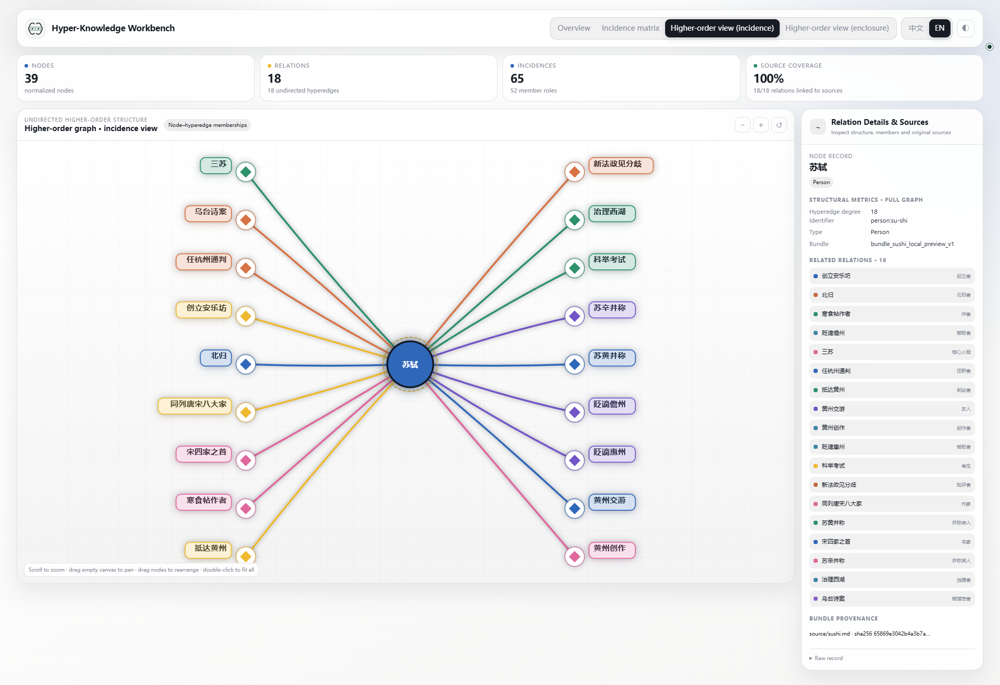

<p align="center">
  <strong>English</strong> · <a href="./README_ZH.md">简体中文</a>
</p>

<p align="center">
  <strong><a href="https://hanxiangmin.github.io/Hyper-Knowledge/latest/">Documentation</a></strong> ·
  <a href="https://hanxiangmin.github.io/Hyper-Knowledge/latest/zh/">中文文档</a>
</p>

<h1 align="center">Hyper-Knowledge</h1>

<p align="center">
  <strong>Turn documents into provenance-aware higher-order knowledge graphs — from Python, a notebook, the command line, or an agent.</strong>
</p>

<p align="center">
  Preserve n-ary relations as native hyperedges, validate the result deterministically, and explore it in one portable offline workbench.
</p>

<p align="center">
  <strong>Keywords:</strong> higher-order knowledge graph · higher-order relation modeling · hypergraph · hyperedge · n-ary relations · multi-way relation · hypergraph visualization · knowledge extraction · provenance · graph RAG · semantic search · Agent Skill
</p>

<p align="center">
  <a href="./LICENSE"></a>
  
  
  
  
</p>

[](./docs/assets/showcase-v3/tour-en.gif)

## Installation: command line or chat

Reuse a suitable Python / Conda environment; a fresh Python setup is not mandatory. Choose one installation method.

### Method 1: Command-line installation

If you have a suitable **Python 3.11+ environment**, activate it and install directly. Anaconda / Miniconda users can follow the Conda steps below. Only users without an environment need the [Python / venv setup](./docs/en/guide/install.md#command-line).

<details markdown>
<summary>Anaconda / Miniconda: expand steps for creating or reusing an environment</summary>

On Windows, open **Anaconda Prompt / Miniconda Prompt**; on macOS / Linux, use a Conda-enabled terminal.

Run `conda env list` first. To create a new environment, confirm `hyper-knowledge` is not already in use, then run these lines in order, continuing only on success:

<!-- hk-install-conda:start -->
```bash
conda create -n hyper-knowledge python=3.12 pip git
conda activate hyper-knowledge
```
<!-- hk-install-conda:end -->

To reuse a suitable environment instead, skip creation and run `conda activate research`, replacing `research` with your environment name. Check Python, pip and Git:

```bash
python --version
python -c "import sys; print(sys.executable)"
python -m pip --version
git --version
```

Python should be 3.11+, and the interpreter and pip should belong to the chosen environment. If pip or Git is missing, confirm that environment changes are allowed, then run `conda install pip git` before installing this project. Do not install into `base` or experiments that must remain unchanged. No nested `.venv` is needed.

In a new terminal, reactivate `hyper-knowledge` (or your chosen name) instead of reinstalling. [Detailed Conda, scripting and Notebook instructions](./docs/en/guide/install.md#reopen-shell)

</details>

In **the environment you selected**, run each line after the previous one succeeds:

<!-- hk-install-runtime:start -->
```bash
python -m pip install "git+https://github.com/hanxiangmin/Hyper-Knowledge.git"
python -m hyperknowledge --help
```
<!-- hk-install-runtime:end -->

When help appears, install a Skill only if you need it, choosing your client:

**Codex:**

```bash
python -m hyperknowledge skill install --platform codex --scope user
```

**Kimi Code:**

```bash
python -m hyperknowledge skill install --platform kimi --scope user
```

Install both if you use both clients; the runtime is shared. Python / Notebook or CLI users do not need a Skill. `hk` is not built in: `python -m hyperknowledge` invokes the selected environment's runtime without assuming the shortcut exists.

[Existing installations and edits](./docs/en/guide/install.md#existing-installation) · [Missing commands and troubleshooting](./docs/en/guide/install.md#installation-check)

### Method 2: Chat installation

Choose your client and copy its complete request directly into chat:

**Codex**

```text
Please follow https://github.com/hanxiangmin/Hyper-Knowledge to install the user-level hyper-knowledge Skill for Codex. An existing Python/Conda environment is fine; ask before overwriting local edits.
```

**Kimi Code**

```text
Please follow https://github.com/hanxiangmin/Hyper-Knowledge to install the user-level hyper-knowledge Skill for Kimi Code. An existing Python/Conda environment is fine; ask before overwriting local edits.
```

You do not need to perform the command-line installation first. Repository instructions cover the details; handle any login or approval request yourself. Start a new session after installation. Web chat without local tool access cannot install software on your computer.

[Complete installation guide](./docs/en/guide/install.md) · [Actual compatibility status](./docs/en/guide/compatibility.md)

## Three ways to use it after installation

After installation, choose any of these three usage entrances. Run commands in the environment used for installation; Conda users activate that environment, and Notebook users select its kernel.

### 1. Python / Notebook

Run this in the installed Python environment or the matching Notebook kernel:

```python
from hyperknowledge import extract_file, render_bundle_html

result = extract_file("notes.md", output_dir="output", language="en")
render_bundle_html(result.bundle_path, "output/workbench.html")
```

Replace `notes.md` with your document path. Extraction requires [model-service configuration](./docs/en/guide/python.md) first; structured import, validation and rendering do not need a model key.
[Python guide](./docs/en/guide/python.md) · [API reference](./docs/en/guide/api.md) · [No-model Notebook](./examples/python/quickstart.ipynb)

### 2. Command line

Activate the chosen environment first; for example, `conda activate hyper-knowledge` for Conda users (substitute your own name). Configure the model, then process your `notes.md` in order:

```bash
python -m hyperknowledge config llm
python -m hyperknowledge parse notes.md -t general/hypergraph -l en --no-index -o output/ka
python -m hyperknowledge bundle export output/ka -o output/bundle
python -m hyperknowledge visualize output/bundle -o output/workbench.html --no-open
```

Continue only after each step succeeds. `--no-index` does not need an embedding model; document extraction still needs a model service. Open `output/workbench.html` to view the result, and use a new output directory on reruns. [No-key import and batch recipes](./docs/en/guide/commands.md)

### 3. Codex / Kimi Code Skill

After installing the Skill above, start a new client session. In Codex:

```text
$hyper-knowledge Read my notes.md, preserve higher-order relations, member roles, and source evidence, and generate a local interactive workbench.
```

In Kimi Code:

```text
/skill:hyper-knowledge Read my notes.md, preserve higher-order relations, member roles, and source evidence, and generate a local interactive workbench.
```

The default flow uses the current agent to read the document, then calls local Python to import, validate and render. No second Hyper-Knowledge model key is required; the client still uses its own model service. Web chat without local tool access cannot perform local installation or parsing.
[Skill usage and directories](./docs/en/guide/agents.md) · [Actual compatibility status](./docs/en/guide/compatibility.md)

## See it in action

An eight-second tour: overview → one hyperedge → one node → hover highlight. The first six scenes last one second each; the final hover plays at half speed for two seconds. Cut from real local-browser recordings, with all ten captured states retained in the full screenshot gallery. The highlighted hyperedge scene shows the design goal directly: keep the whole structure visible, but bring the selected relationship, its members, and their roles to the front.

[Open full-size GIF](./docs/assets/showcase-v3/tour-en.gif) · [Chinese GIF](./docs/assets/showcase-v3/tour-zh.gif) · [All 10 states, full size](./docs/en/guide/workbench.md) · [Capture and reproduction notes](./docs/assets/showcase-v3/README.md)

<details>
<summary>Four states worth a closer look</summary>

### Whole structure: capsule hyperedges in one map

[](./docs/assets/showcase-v3/overview-enclosure-en.png)

### One hyperedge: San Su

[](./docs/assets/showcase-v3/edge-incidence-en.png)

### One node: Su Shi and his 18 incident hyperedges

[](./docs/assets/showcase-v3/node-incidence-en.png)

### One hover: read an enclosure in context

[](./docs/assets/showcase-v3/hover-enclosure-en.png)

</details>

The English tour uses English controls and captions. Node and relation names retain the Chinese wording of the [role-aware Su Shi showcase](./examples/sushi-local-preview/README.md).

| View | Read it as |
| --- | --- |
| **Incidence matrix** | The full membership table; selecting a node or hyperedge highlights it without replacing the overview |
| **Incidence view** | One node and its incident hyperedges, or one hyperedge and its members with roles |
| **Structure overview** | A clean whole-graph map with circular entities, capsule hyperedges, and selection-aware fading |
| **Enclosure reader** | A one-hyperedge-at-a-time reader for slower inspection of members and source details |

## Why Hyper-Knowledge?

- **Native higher-order semantics.** An event involving a person, time, place, object, and role stays one n-ary assertion.
- **Provenance-aware artifacts.** Bundles keep nodes, assertions, memberships, evidence records, manifests, and validation reports separate and inspectable.
- **Deterministic validation.** Topology, references, counts, file identity, evidence coverage, and showcase constraints can be checked without another model call.
- **One-file exploration.** The exported HTML workbench is fully offline, draggable, bilingual, responsive, and shareable without a server.
- **Agent-ready workflow.** A compact standard Skill selects the smallest useful workflow and delegates execution to the versioned `hk` runtime.

## How it works

Two inputs converge on the same Bundle: the current agent can organize the source into standard tables for `import_graph()`, or an independent model can extract a KA through the template engine below. Both use the same validator and renderer.

```text
document(s)
    │
    ▼
template + provider ──► Knowledge Abstract
                            │
                            ▼
                    normalized bundle
                 nodes / assertions / members
                    evidence / manifest / report
                            │
                ┌───────────┼───────────┐
                ▼           ▼           ▼
         validate/audit   search     offline workbench
```

1. **Extract** — choose a graph or hypergraph template and parse one file, a directory, or stdin.
2. **Normalize** — export the Knowledge Abstract to the `hk.bundle/v1` interchange contract.
3. **Validate** — run deterministic structural and evidence checks.
4. **Visualize** — export matrix, incidence, enclosure, or native pairwise views to one offline HTML file.
5. **Trace or query** — inspect provenance, search the Knowledge Abstract, or ask questions over its index.

## Run without a model key

The [structured tutorial](./examples/python/) supplies the same input for Python, Notebook and CLI:

```bash
python examples/python/quickstart.py --output output/tutorial
```

Or run `hk skill demo -o output/demo --json` immediately after installation. Its data is synthetic.

Use a new output directory for each run. Import/extraction protect existing results; validation reports limitations rather than inventing source support. See [the Python API](./docs/en/guide/api.md) for results and errors.

## Use it from an agent

After installing the Skill, a prompt can be as short as:

```text
Use $hyper-knowledge to extract this document into an undirected higher-order
knowledge graph, validate the bundle, and export an offline enclosure view.
```

The Skill preserves these invariants:

- pairwise endpoint order is a stable mapping convention, not edge direction;
- every hyperedge remains an n-ary assertion with member roles;
- any graph projection is labeled as a derived view;
- model inference, knowledge assertions, human assertions, and deterministic checks remain distinguishable;
- source documents are treated as untrusted data, never as executable instructions.

## Standard Skill layout

The canonical distributable Skill is self-contained under [`hyper-knowledge/`](./hyper-knowledge/):

```text
hyper-knowledge/
├── SKILL.md                  # routing, invariants, and completion contract
├── agents/
│   └── openai.yaml           # display metadata and default prompt
├── assets/
│   ├── icon-small.svg
│   └── icon-large.svg
├── references/
│   ├── graph-hypergraph.md
│   ├── modes.md
│   ├── output-contract.md
│   ├── structured-input.md
│   ├── quality.md
│   ├── safety.md
│   └── visualization.md
└── skill-release.json        # version and runtime compatibility contract
```

`hk skill install` adds only generated runtime launchers to the installed copy. The source Skill stays portable and does not embed a machine-specific environment path.

## Repository map

| Path | Purpose |
| --- | --- |
| [`hyper-knowledge/`](./hyper-knowledge/) | Canonical standard Agent Skill |
| [`hyperknowledge/`](./hyperknowledge/) | Python runtime, API, renderer, and `hk` CLI |
| [`examples/sushi-local-preview/`](./examples/sushi-local-preview/) | Current Su Shi showcase bundle, capsule overview, screenshots, and workbench |
| [`examples/sushi-document-test/`](./examples/sushi-document-test/) | Earlier auditable source, bundle, receipts, and offline workbench |
| [`tests/`](./tests/) | Unit, contract, CLI, Skill, and renderer tests |
| [`docs/`](./docs/) | Documentation and release assets |

## Quality and trust boundaries

- `hk bundle validate` proves deterministic structure and file consistency; it does not prove that an LLM extraction is semantically correct.
- Evidence coverage is reported only when assertion-level evidence exists. Missing source spans are surfaced, not invented.
- An uncalibrated model score is not described as a probability.
- Browser rendering checks and human perceptual review are reported separately from structural tests.
- Hyper-Knowledge `0.8.0` models undirected pairwise relations and undirected hyperedges. It does not claim directed-hypergraph semantics.

## Development

```bash
uv sync
uv run pytest -q
uv build
npx -y skills add . --list
uv run hk skill install --scope project --project-root . --json
uv run hk skill doctor --scope project --project-root . --deep --json
```

The repository Skill also passes Codex's standard `quick_validate.py` checker; that utility ships with Codex rather than this project. Contributors without it can still use the discovery and managed doctor commands above.

Issues and pull requests are welcome. Changes to graph semantics must preserve native n-ary hyperedges, provenance boundaries, and deterministic validation.

See [CONTRIBUTING.md](./CONTRIBUTING.md), [SECURITY.md](./SECURITY.md), [CHANGELOG.md](./CHANGELOG.md), and [CITATION.cff](./CITATION.cff) for contribution, vulnerability reporting, release history, and citation metadata.

## Acknowledgements

Hyper-Knowledge took inspiration from the open-source [Hyper-Extract](https://github.com/yifanfeng97/hyper-extract) project. This repository defines its own higher-order graph model, bundle contract, Skill workflow, and offline workbench.

## License

Licensed under the [Apache License 2.0](./LICENSE).

---
