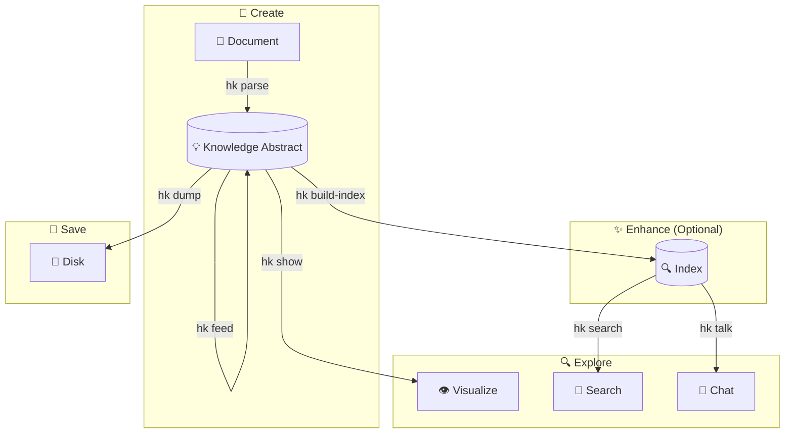

# CLI Guide

The Hyper-Knowledge CLI (`hk`) provides a powerful, easy-to-use interface for knowledge extraction directly from your terminal.

---

## Installation

=== "uv (recommended)"

    ```bash
    uv tool install hyperknowledge
    ```

=== "pipx"

    ```bash
    pipx install hyperknowledge
    ```

Verify installation:

```bash
hk --version
```

---

## Quick Command Reference

| Command | Purpose | Common Flags |
|---------|---------|--------------|
| `hk parse` | Extract knowledge from documents | `-t` template, `-o` output, `-l` language |
| `hk show` | Visualize knowledge graph | — |
| `hk export obsidian` | Export to an Obsidian vault | `-o` output, `--name`, `-f` force |
| `hk search` | Semantic search in knowledge abstract | `-n` top-k results |
| `hk talk` | Chat with knowledge abstract | `-i` interactive, `-q` query |
| `hk feed` | Add documents incrementally | — |
| `hk info` | Show knowledge abstract statistics | — |
| `hk build-index` | Build/rebuild search index | `-f` force rebuild |
| `hk clean` | Remove a KA's index (or the whole KA) | `-a` all, `-y` yes |
| `hk list` | List templates and methods | `template` or `method` |
| `hk config` | Manage configuration | `init`, `show`, `llm`, `embedder` |

---

## Complete Workflow

The typical workflow for extracting and interacting with knowledge:



1. **Create** — Extract knowledge from documents (`hk parse`)
2. **Enhance** — Add documents incrementally (`hk feed`), build index (`hk build-index`)
3. **Explore** — Visualize (`hk show`), search (`hk search`), chat (`hk talk`)
4. **Save** — Persist to disk (`hk dump`)

→ [Detailed Workflow Walkthrough](workflow.md)

---

## Getting Started

### 1. Configure API Key

=== "OpenAI"

    ```bash
    hk config init -p openai -k YOUR_OPENAI_API_KEY
    ```

=== "Bailian (Alibaba Cloud)"

    ```bash
    hk config init -p bailian -k YOUR_BAILIAN_API_KEY
    ```

=== "DeepSeek"

    ```bash
    hk config llm -p deepseek -k YOUR_DEEPSEEK_API_KEY
    hk config embedder -p openai -k YOUR_OPENAI_API_KEY
    ```

=== "Anthropic (Claude)"

    Anthropic provides LLM only — pair with an OpenAI-compatible embedder:

    ```bash
    hk config llm -p anthropic -k YOUR_ANTHROPIC_API_KEY
    hk config embedder -p openai -k YOUR_OPENAI_API_KEY
    ```

=== "Local vLLM"

    First install [vLLM](https://docs.vllm.ai/) and start both services:

    ```bash
    # Start LLM service (~8GB VRAM)
    vllm serve Qwen/Qwen3.5-9B --port 8000 --api-key dummy

    # Start Embedding service (~2GB VRAM)
    vllm serve BAAI/bge-m3 --task embed --port 8001
    ```

    Then configure Hyper-Knowledge:

    ```bash
    hk config llm -p vllm \
      -u http://localhost:8000/v1 \
      -k dummy \
      -m Qwen/Qwen3.5-9B

    hk config embedder -p vllm \
      -u http://localhost:8001/v1 \
      -k dummy \
      -m BAAI/bge-m3
    ```

    > Full deployment options (quantization, Docker, etc.) see [Provider System](../concepts/provider-system.md).

### 2. Extract Knowledge

```bash
hk parse document.md -t general/biography_graph -o ./output/ -l en
```

### 3. Visualize

```bash
hk show ./output/
```

---

## Commands in Detail

### Knowledge Extraction

- **[`hk parse`](commands/parse.md)** — Extract knowledge from documents
- **[`hk feed`](commands/feed.md)** — Add documents to existing knowledge abstract

### Exploration

- **[`hk show`](commands/show.md)** — Visualize knowledge graph
- **[`hk search`](commands/search.md)** — Semantic search
- **[`hk talk`](commands/talk.md)** — Chat with knowledge abstract
- **[`hk info`](commands/info.md)** — View knowledge abstract statistics
- **[`hk export obsidian`](commands/export.md)** — Export to an Obsidian vault

### Management

- **[`hk build-index`](commands/build-index.md)** — Build search index
- **[`hk clean`](commands/clean.md)** — Remove a KA's index, or the whole KA
- **[`hk list`](commands/list.md)** — List available templates/methods
- **[`hk config`](commands/config.md)** — Configuration management

---

## Configuration

The CLI stores configuration in `~/.hk/config.toml`.

→ [Configuration Reference](configuration.md)

---

## Template vs Method

Hyper-Knowledge offers two ways to extract knowledge:

### Templates (Recommended for Most Users)

Domain-specific, ready-to-use configurations:

```bash
hk parse doc.md -t general/biography_graph -l en
```

### Methods (Advanced)

Underlying extraction algorithms:

```bash
hk parse doc.md -m light_rag
```

→ [Learn when to use each](../concepts/architecture.md)

---

## Language Support

Templates support multiple languages:

```bash
# English
hk parse doc.md -t general/biography_graph -l en

# Chinese
hk parse doc.md -t general/biography_graph -l zh
```

Method templates always use English prompts.

---

## Examples by Use Case

### Research

```bash
# Extract from a research paper
hk parse paper.md -t general/concept_graph -o ./paper_kb/ -l en

# Ask questions about it
hk talk ./paper_kb/ -q "What are the main contributions?"
```

### Biography Analysis

```bash
# Extract from a biography
hk parse biography.md -t general/biography_graph -o ./bio_kb/ -l en

# Visualize life events
hk show ./bio_kb/
```

### Legal Document Analysis

```bash
# Extract contract obligations
hk parse contract.md -t legal/contract_obligation -o ./contract_kb/ -l en

# Search for specific clauses
hk search ./contract_kb/ "termination conditions"
```

---

## Tips and Best Practices

1. **Use templates for domain-specific tasks** — They're optimized for specific use cases
2. **Build the index** — Required for search and chat functionality
3. **Feed incrementally** — Add documents over time without reprocessing
4. **Choose the right language** — Improves extraction quality for non-English documents

---

## Getting Help

- View help for any command: `he <command> --help`
- List all templates: `hk list template`
- List all methods: `hk list method`
- [FAQ](../resources/faq.md)
- [Troubleshooting](../resources/troubleshooting.md)
