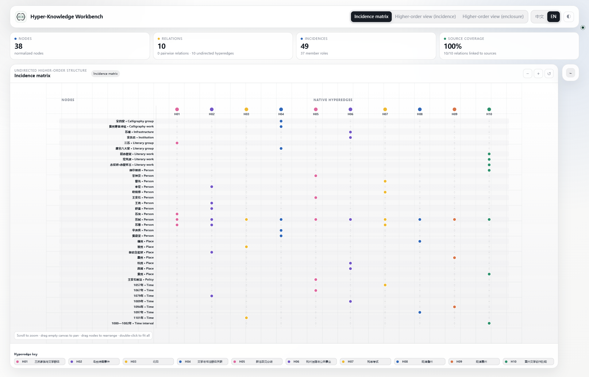
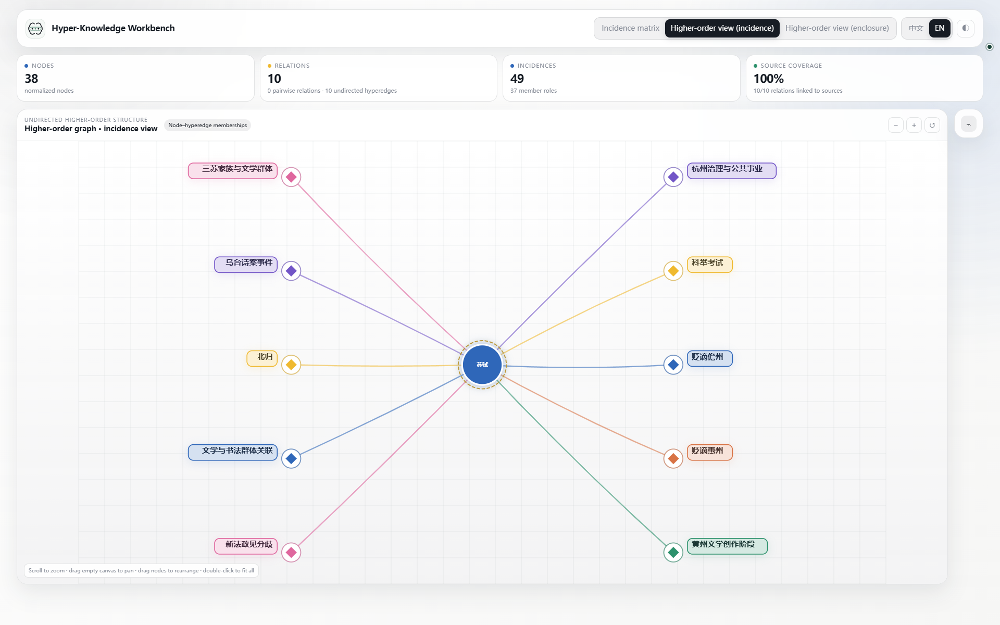
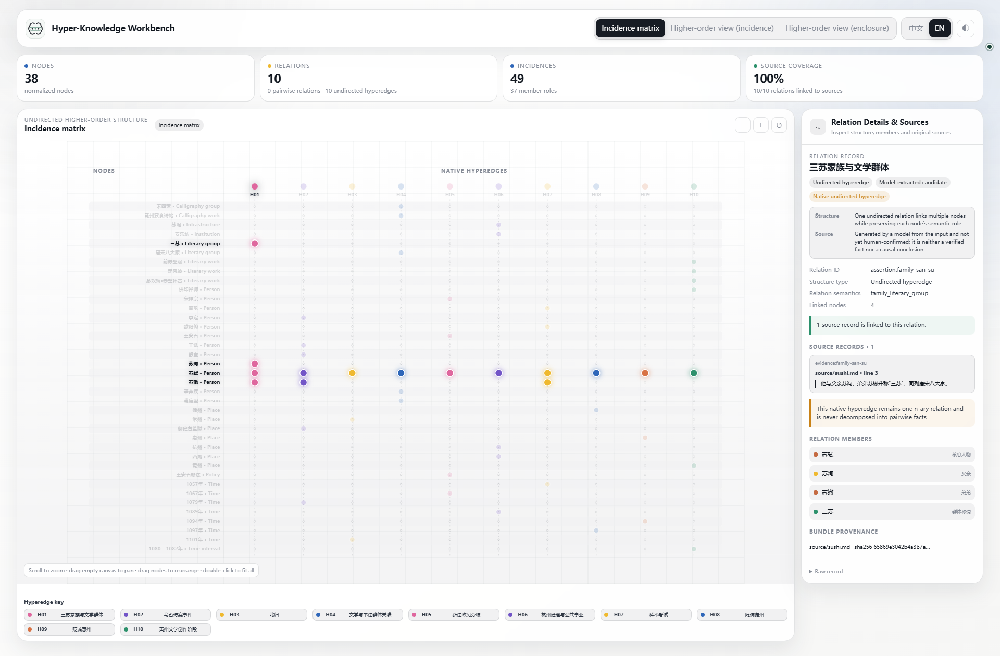
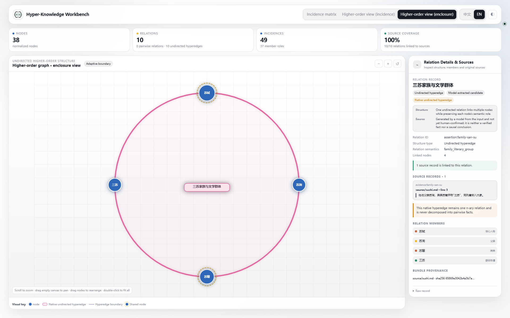
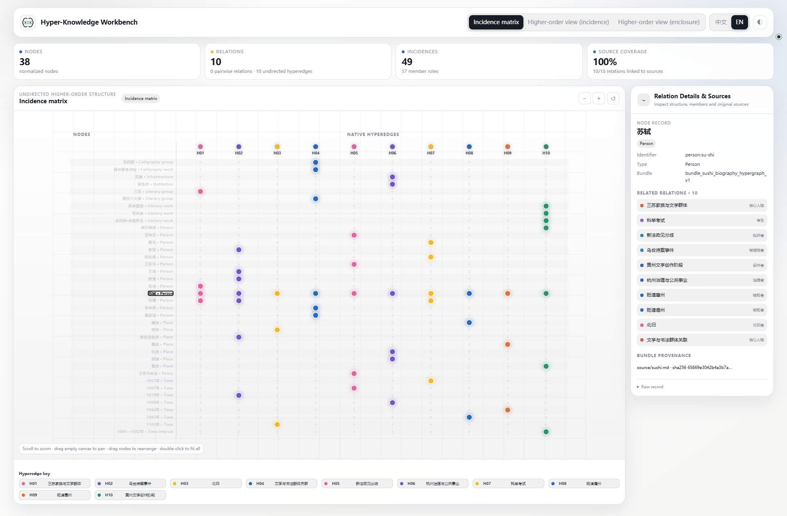
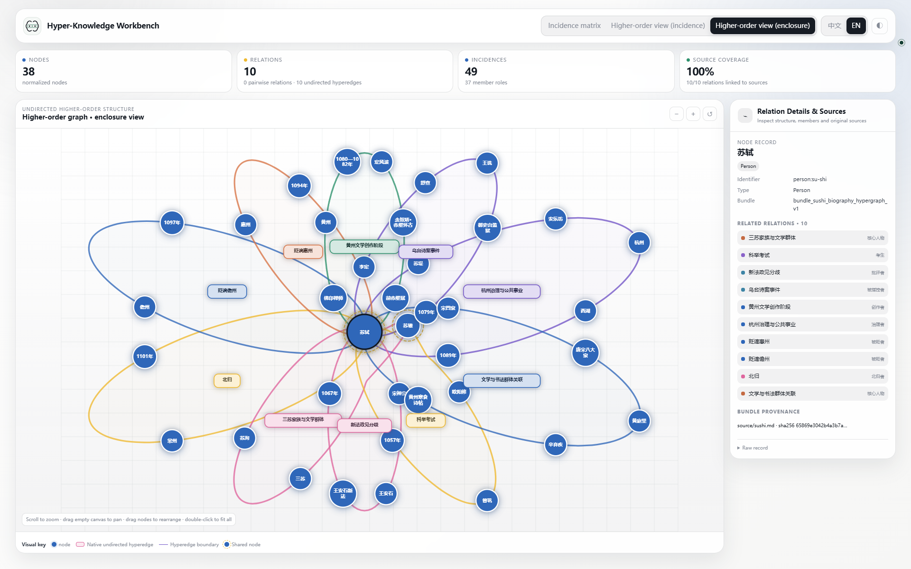

# Three views, three questions

The same bundle can be read as a table, a membership diagram, or a set of enclosures. Switching views changes the presentation, not the entities or memberships.

[Open full-size GIF](../../assets/showcase-v2/tour-en.gif) · [Chinese GIF](../../assets/showcase-v2/tour-zh.gif) · [Read the Su Shi example](sushi.md)

Seven scenes in eight seconds: overview → one hyperedge → one node → hover highlight. The first six scenes are one-second, normal-speed excerpts from real local-browser recordings; the final hover plays at half speed for two seconds so its movement and highlight are easier to follow. The gallery below keeps all ten captured states. English controls accompany the original Chinese node and hyperedge names.

## Choose the question, then the view

| Question | View | Selection behavior |
| --- | --- | --- |
| Which node belongs to which hyperedge? | Incidence matrix | Keep the full table and highlight the selection |
| Which hyperedges contain this node? Who belongs to this hyperedge? | Incidence | Show the selected node's incident hyperedges, or expand the selected hyperedge's members |
| Where do relationships share context? | Enclosure | Read overlaps spatially; click to focus or hover to highlight |

An incidence diamond represents a relationship, not another entity extracted from the document. Labels beside its links describe member roles. In enclosures, dashed outer rings mark shared nodes; node area is not a measure of a person's importance.

## Ten states, one dataset

The comparisons below use **三苏家族与文学群体** (`assertion:family-san-su`) and **苏轼** (`person:su-shi`) throughout. Expand a group, then click any screenshot to inspect the original image.

01–03 · Overview: see the same data three ways

<figure markdown>

<figcaption>01 · Matrix — the complete membership table.</figcaption>
</figure>
<figure markdown>

<figcaption>02 · Incidence — the starting relationship overview.</figcaption>
</figure>
<figure markdown>

<figcaption>03 · Enclosure — the complete higher-order structure.</figcaption>
</figure>

04–06 · Select a hyperedge: the San Su family

The family hyperedge contains 苏轼, 苏洵, 苏辙, and 三苏. Their roles distinguish the central person, father, younger brother, and group designation.

<figure markdown>

<figcaption>04 · Matrix — the selected hyperedge is highlighted in the full table.</figcaption>
</figure>
<figure markdown>

<figcaption>05 · Incidence — four members, with an explicit role on each link.</figcaption>
</figure>
<figure markdown>

<figcaption>06 · Enclosure — the same four members inside one relationship.</figcaption>
</figure>

07–09 · Select a node: Su Shi

苏轼 belongs to ten hyperedges in this example. The incidence view summarizes those memberships without expanding every other member. The enclosure view retains the member context of the incident hyperedges.

<figure markdown>

<figcaption>07 · Matrix — Su Shi's memberships highlighted without filtering the table.</figcaption>
</figure>
<figure markdown>

<figcaption>08 · Incidence — one node and its ten incident hyperedges.</figcaption>
</figure>
<figure markdown>

<figcaption>09 · Enclosure — the selected node in its shared relationship context.</figcaption>
</figure>

10 · Hover: isolate a relationship visually

Move the pointer onto the family hyperedge title. Its enclosure takes a light relation-colored fill, its members remain clear, and unrelated content fades. Moving away restores the overview; no click or data change is involved.

<figure markdown>

<figcaption>10 · Enclosure hover — compare with the unhighlighted overview in state 03.</figcaption>
</figure>

## Read, rearrange, reset

- **Click** a node or hyperedge to inspect its memberships, roles, and source details.
- **Hover** over an enclosure title to distinguish that relationship from its surroundings.
- **Drag** a node to adjust the layout and refit affected enclosures; knowledge records stay unchanged.
- **Reset** to clear focus and local layout changes, then fit the complete content.

For dense relationships, use the matrix instead of shrinking labels further. The workbench is a standalone HTML file; exploring an existing export does not require a model service or server.
