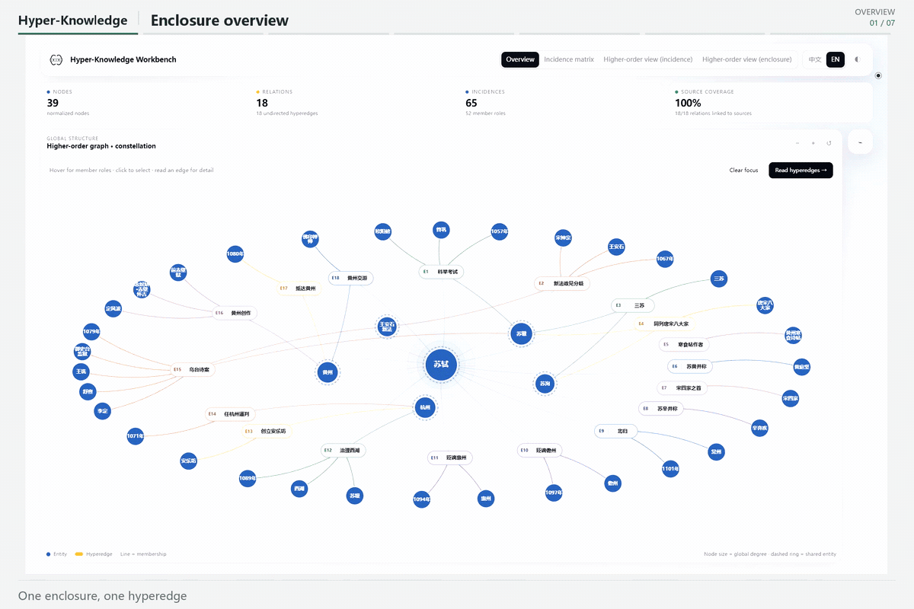
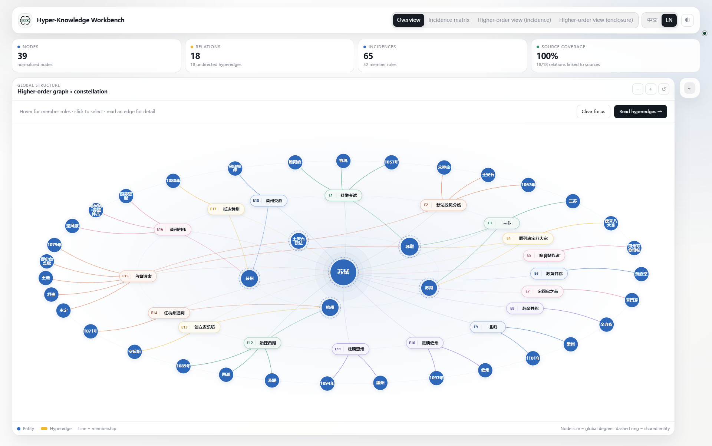
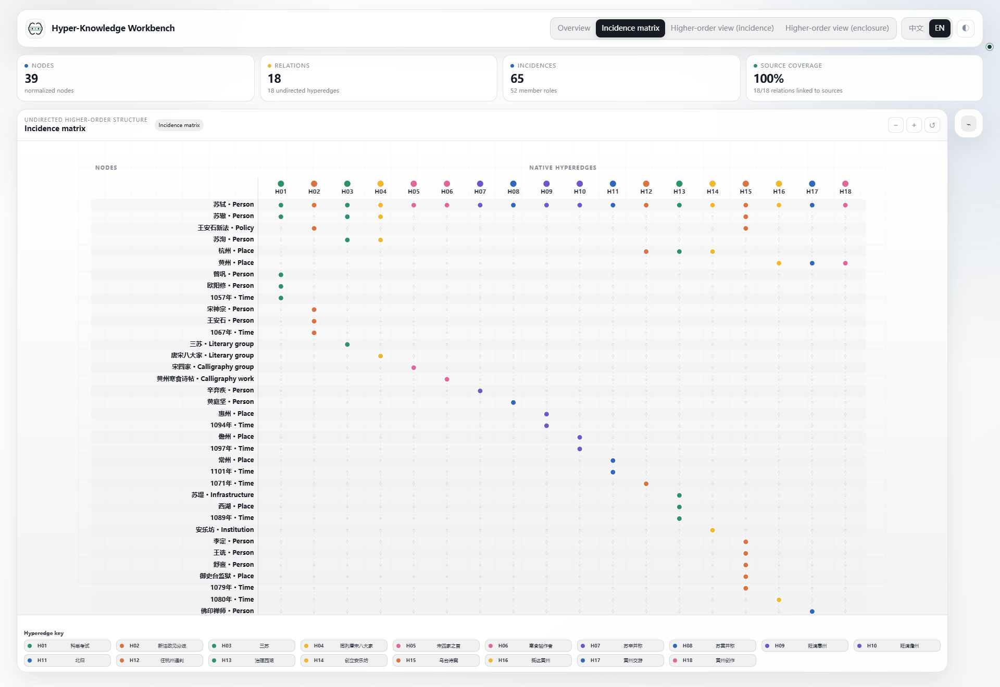
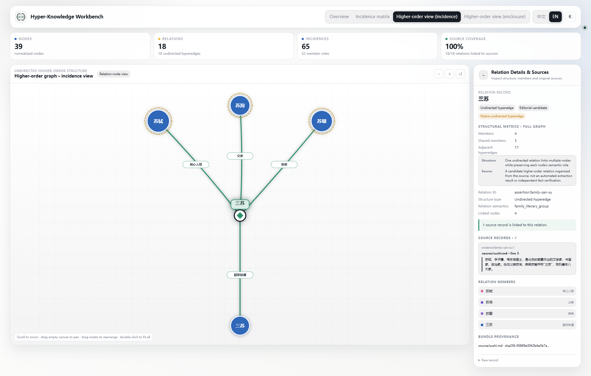
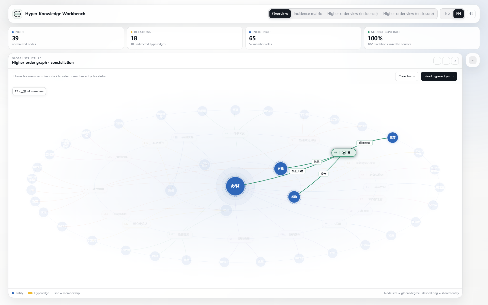

<div class="hk-hero" markdown>
<p class="hk-kicker">Hyper-Knowledge / Agent Skill</p>

# Keep relationships in context.

<p class="hk-lead">A person, a time, a place, and a role often explain one event together. Hyper-Knowledge organizes that context as a hyperedge, with an agent-guided workflow, inspectable data bundles, and an offline workbench.</p>

[Install the Skill](guide/install.md){ .md-button .md-button--primary }
[Explore the Su Shi example](guide/sushi.md){ .md-button }
</div>

## Install from Codex chat

Paste this request directly into a local Codex chat. No terminal command or `codex` prefix is needed:

```text
Please install hyper-knowledge from https://github.com/hanxiangmin/Hyper-Knowledge.
Follow the repository's manual installation steps to install the project runtime
in a persistent Python environment and the user-level Codex Skill.
Verify with hk skill doctor --scope user --deep --json.
If an existing installation has local changes, ask before overwriting them.
```

Review and approve network and file-write requests when prompted. [Terminal or manual installation](guide/install.md#terminal)

<figure class="hk-media" markdown>

[](../assets/showcase-v3/tour-en.gif)

<figcaption>Eight-second looping GIF: structure overview → matrix → selected hyperedge → selected node → enclosure hover. It is cut from a real local-browser recording; click to open the full-size GIF.</figcaption>
</figure>

## Start with a concrete question

“What happened to Su Shi, when, and where?” should not become one long node name.

| Entity nodes | Event hyperedge | Member roles |
| --- | --- | --- |
| Su Shi, 1101, Changzhou | Return north | Returning person, time, destination |

The person and place can participate in another event. Each date stays attached to its own context. A source record belongs to the event so readers can check the underlying passage. [Learn the modeling approach](guide/modeling.md)

## Work toward an inspectable graph

<div class="hk-three" markdown>
<section markdown>

### Model

Describe the task and material to the Skill. Identify entities, events, and roles before choosing a template and running extraction.

[Process your first document](guide/document.md)
</section>
<section markdown>

### Check

Keep nodes, assertions, memberships, and evidence in separate tables. Validate references and file identity; distinguish source support from model interpretation.

[Read the bundle](guide/artifacts.md)
</section>
<section markdown>

### Explore

Move from the whole structure to a node and then to one hyperedge. Use the matrix for dense membership patterns and incidence for explicit roles.

[Choose a view](guide/workbench.md)
</section>
</div>

## A useful request to your agent

```text
Use hyper-knowledge on this document.
Keep people, places, and times as separate nodes. Preserve each event as a
hyperedge with member roles. Deliver a validated bundle and an offline
workbench, and identify relationships that lack source support.
```

The Skill turns the request into an inspectable workflow; `hk` executes it. Start with the offline demo to check the installation and renderer before configuring a model. [Install and verify](guide/install.md)

## Look first, then go deeper

<div class="hk-gallery" markdown>
<figure markdown>

[](../assets/showcase-v3/overview-enclosure-en.png)

<figcaption>Start from the full structure to see shared nodes and hyperedge distribution.</figcaption>
</figure>
<figure markdown>

[](../assets/showcase-v3/overview-matrix-en.png)

<figcaption>Map memberships without crossing lines.</figcaption>
</figure>
<figure markdown>

[](../assets/showcase-v3/edge-incidence-en.png)

<figcaption>Expand one hyperedge into members and roles.</figcaption>
</figure>
<figure markdown>

[](../assets/showcase-v3/hover-enclosure-en.png)

<figcaption>Trace a relationship while the rest fades.</figcaption>
</figure>
</div>
