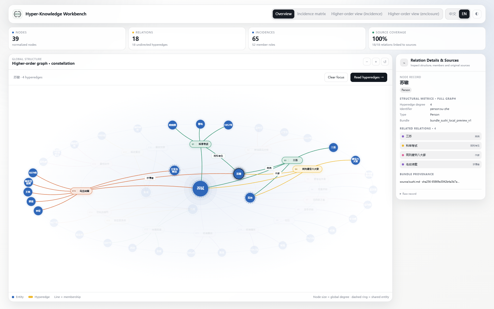

<div class="hk-hero" markdown>
<p class="hk-kicker">Hyper-Knowledge / Python · CLI · Agent Skill</p>

# Keep relationships in context.

<p class="hk-lead">A person, a time, a place, and a role often explain one event together. Hyper-Knowledge organizes that context as a hyperedge, with an agent-guided workflow, inspectable data bundles, and an offline workbench.</p>

[Get started](guide/install.md){ .md-button .md-button--primary }
[Explore the Su Shi example](guide/sushi.md){ .md-button }
</div>

## Two installation methods

Use your existing Python or Conda environment, or prepare one if needed. Choose either command-line or chat installation.

[Command-line instructions](guide/install.md#command-line){ .md-button .md-button--primary }
[Chat instructions](guide/install.md#chat-install){ .md-button }

<details markdown>
<summary>Command-line installation: existing Python / Anaconda / Miniconda</summary>

If you have a suitable **Python 3.11+ environment**, activate it and install directly. Anaconda / Miniconda users can follow the Conda steps below. Only users without an environment need the [Python / venv setup](guide/install.md#command-line).

<details markdown>
<summary>Anaconda / Miniconda: expand steps for creating or reusing an environment</summary>

On Windows, open **Anaconda Prompt / Miniconda Prompt**; on macOS / Linux, use a Conda-enabled terminal.

Run `conda env list` first. To create a new environment, confirm `hyper-knowledge` is not already in use, then run these lines in order, continuing only on success:

<!-- hk-install-conda:start -->
```bash
conda create -n hyper-knowledge python=3.12 pip git
conda activate hyper-knowledge
```
<!-- hk-install-conda:end -->

To reuse a suitable environment instead, skip creation and run `conda activate research`, replacing `research` with your environment name. Check Python, pip and Git:

```bash
python --version
python -c "import sys; print(sys.executable)"
python -m pip --version
git --version
```

Python should be 3.11+, and the interpreter and pip should belong to the chosen environment. If pip or Git is missing, confirm that environment changes are allowed, then run `conda install pip git` before installing this project. Do not install into `base` or experiments that must remain unchanged. No nested `.venv` is needed.

In a new terminal, reactivate `hyper-knowledge` (or your chosen name) instead of reinstalling. [Detailed Conda, scripting and Notebook instructions](guide/install.md#reopen-shell)

</details>

In **the environment you selected**, run each line after the previous one succeeds:

<!-- hk-install-runtime:start -->
```bash
python -m pip install "git+https://github.com/hanxiangmin/Hyper-Knowledge.git"
python -m hyperknowledge --help
```
<!-- hk-install-runtime:end -->

When help appears, install a Skill only if you need it, choosing your client:

**Codex:**

```bash
python -m hyperknowledge skill install --platform codex --scope user
```

**Kimi Code:**

```bash
python -m hyperknowledge skill install --platform kimi --scope user
```

Install both if you use both clients; the runtime is shared. Python / Notebook or CLI users do not need a Skill. `hk` is not built in: `python -m hyperknowledge` invokes the selected environment's runtime without assuming the shortcut exists.

[Existing installations and edits](guide/install.md#existing-installation) · [Missing commands and troubleshooting](guide/install.md#installation-check)

</details>

### Install in chat

Choose your client and copy its complete request directly into chat:

**Codex**

```text
Please follow https://github.com/hanxiangmin/Hyper-Knowledge to install the user-level hyper-knowledge Skill for Codex. An existing Python/Conda environment is fine; ask before overwriting local edits.
```

**Kimi Code**

```text
Please follow https://github.com/hanxiangmin/Hyper-Knowledge to install the user-level hyper-knowledge Skill for Kimi Code. An existing Python/Conda environment is fine; ask before overwriting local edits.
```

You do not need to perform the command-line installation first. Repository instructions cover the details; handle any login or approval request yourself. Start a new session after installation. Web chat without local tool access cannot install software on your computer.

## After installation: one core, three ways to use it

After installation, use any of these entrances in your chosen Python / Conda environment. [Select the environment in a new terminal](guide/install.md#reopen-shell)

<div class="hk-three" markdown>
<section markdown>

### Python / Notebook

`extract_file()` parses text; `import_graph()` accepts structured input without a model key.

[Python guide](guide/python.md) · [API reference](guide/api.md)
</section>
<section markdown>

### Command line

`hk parse` → `hk bundle export` → `hk visualize`.
Structured input goes directly through `hk bundle import`.

[Commands and examples](guide/commands.md)
</section>
<section markdown>

### Agent Skill

Codex and Kimi Code read the same standard Skill and call local Python.
The default workflow uses the current agent's model, not a second key.

[Install and invoke](guide/agents.md) · [Compatibility](guide/compatibility.md)
</section>
</div>

<figure class="hk-media" markdown>

[](../assets/showcase-v3/tour-en.gif)

<figcaption>Eight-second looping GIF: structure overview → matrix → selected hyperedge → selected node → enclosure hover. It is cut from a real local-browser recording; click to open the full-size GIF.</figcaption>
</figure>

## Start with a concrete question

“What happened to Su Shi, when, and where?” should not become one long node name.

| Entity nodes | Event hyperedge | Member roles |
| --- | --- | --- |
| Su Shi, 1101, Changzhou | Return north | Returning person, time, destination |

The person and place can participate in another event. Each date stays attached to its own context. A source record belongs to the event so readers can check the underlying passage. [Learn the modeling approach](guide/modeling.md)

## Work toward an inspectable graph

<div class="hk-three" markdown>
<section markdown>

### Model

Describe the task and material to the Skill. Identify entities, events, and roles before choosing a template and running extraction.

[Process your first document](guide/document.md)
</section>
<section markdown>

### Check

Keep nodes, assertions, memberships, and evidence in separate tables. Validate references and file identity; distinguish source support from model interpretation.

[Read the bundle](guide/artifacts.md)
</section>
<section markdown>

### Explore

Move from the whole structure to a node and then to one hyperedge. Use the matrix for dense membership patterns and incidence for explicit roles.

[Choose a view](guide/workbench.md)
</section>
</div>

## A useful request to your agent

```text
Use hyper-knowledge on this document.
Keep people, places, and times as separate nodes. Preserve each event as a
hyperedge with member roles. Deliver a validated bundle and an offline
workbench, and identify relationships that lack source support.
```

The current agent reads the source; local Python imports and renders the result. No second model key is needed for this route. [Understand both workflows](guide/agents.md)

## Look first, then go deeper

Click a screenshot to fill the screen. Click it again, click the background, or press Esc to return to the same spot.

<div class="hk-gallery" markdown>
<figure markdown>

[](../assets/showcase-v3/overview-enclosure-en.png)

<figcaption>Start from the full structure to see shared nodes and hyperedge distribution.</figcaption>
</figure>
<figure markdown>

[](../assets/showcase-v3/overview-matrix-en.png)

<figcaption>Map memberships without crossing lines.</figcaption>
</figure>
<figure markdown>

[](../assets/showcase-v3/edge-incidence-en.png)

<figcaption>Expand one hyperedge into members and roles.</figcaption>
</figure>
<figure markdown>

[](../assets/showcase-v3/node-su-zhe-overview-en.png)

<figcaption>Select Su Zhe to highlight his four hyperedges while other relationships fade.</figcaption>
</figure>
</div>
