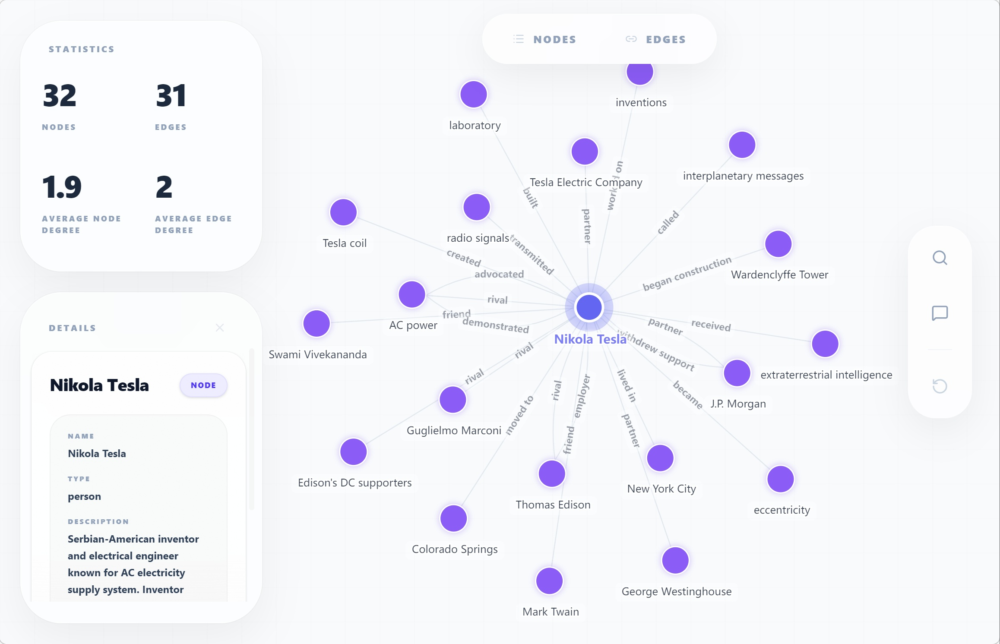

# Frequently Asked Questions

Common questions about Hyper-Knowledge.

---

## General

### What is Hyper-Knowledge?

Hyper-Knowledge is an LLM-powered knowledge extraction framework that transforms unstructured text into structured knowledge graphs, lists, models, and more.

### What can I use it for?

- Research paper analysis
- Knowledge base construction
- Document processing
- Information extraction
- Question-answering systems

### Is it free?

The software is open-source (Apache-2.0). You need an API key from a supported LLM provider (OpenAI, Anthropic, DeepSeek, Alibaba Bailian, or local vLLM).

---

## Installation

### What are the requirements?

- Python 3.11+
- An API key from any supported provider (OpenAI, Anthropic, DeepSeek, Bailian, or local vLLM)

### How do I install it?

```bash
pip install "hyper-knowledge @ git+https://github.com/hanxiangmin/Hyper-Knowledge.git"
```

### Installation fails with "No module named 'hyperknowledge'"

Try:
```bash
pip install --upgrade hyperknowledge
```

Or use a virtual environment:
```bash
python -m venv venv
source venv/bin/activate  # Windows: venv\Scripts\activate
pip install "hyper-knowledge @ git+https://github.com/hanxiangmin/Hyper-Knowledge.git"
```

---

## Configuration

### Where do I set my API key?

**Option 1**: CLI

```bash
# OpenAI / Bailian (one-step)
hk config init -p openai -k YOUR_API_KEY
hk config init -p bailian -k YOUR_API_KEY

# Anthropic / DeepSeek (LLM + separate embedder)
hk config llm -p deepseek -k YOUR_DEEPSEEK_API_KEY
hk config embedder -p openai -k YOUR_OPENAI_API_KEY
```

**Option 2**: Environment variable

```bash
export OPENAI_API_KEY=your-api-key        # OpenAI/Bailian
export ANTHROPIC_API_KEY=your-api-key     # Anthropic
export DEEPSEEK_API_KEY=your-api-key      # DeepSeek
```

**Option 3**: `.env` file
```
OPENAI_API_KEY=your-api-key
```

### Can I use a different LLM provider?

Yes! Hyper-Knowledge supports OpenAI, Anthropic, DeepSeek, Alibaba Bailian, and local vLLM out of the box:

```bash
# OpenAI / Bailian
hk config init -p openai -k YOUR_API_KEY

# DeepSeek / Anthropic (LLM only, pair with OpenAI embedder)
hk config llm -p deepseek -k YOUR_DEEPSEEK_API_KEY
hk config embedder -p openai -k YOUR_OPENAI_API_KEY
```

For custom OpenAI-compatible endpoints:
```bash
hk config llm --base-url https://your-provider.com/v1 -k YOUR_API_KEY
```

See [Provider System](../concepts/provider-system.md) for the full compatibility list.

### Which models are supported?

- **OpenAI**: gpt-4o, gpt-4o-mini, gpt-5
- **Anthropic**: claude-opus-4-8, claude-sonnet-4-6, claude-haiku-4-5
- **DeepSeek**: deepseek-v4-flash, deepseek-v4-pro
- **Alibaba Bailian**: qwen-plus, qwen-turbo, qwen3.6-plus
- **Local vLLM**: Any model served via vLLM (e.g. Qwen/Qwen3.5-9B)

See [Provider System](../concepts/provider-system.md) for the full compatibility table.

---

## Usage

### Which template should I use?

See the [How to Choose](../templates/how-to-choose.md) guide or use:
```bash
hk list template
```

### How do I process a PDF?

Convert to text first:
```bash
pdftotext document.pdf document.txt
hk parse document.txt -t general/graph -l en
```

### Can I process multiple documents?

**Option 1**: Feed incrementally
```bash
hk parse doc1.md -t general/graph -o ./ka/ -l en
hk feed ./ka/ doc2.md
hk feed ./ka/ doc3.md
```

**Option 2**: Process directory
```bash
hk parse ./docs/ -t general/graph -o ./ka/ -l en
```

### How do I extract in Chinese?

```bash
hk parse doc.md -t general/biography_graph -l zh
```

---

## Performance

### Why is extraction slow?

- Long documents are chunked and processed in parallel
- Each chunk requires an LLM call
- Consider using `--no-index` during batch processing

### How can I speed it up?

1. Use smaller chunk sizes
2. Reduce `max_workers` if hitting rate limits
3. Process documents in parallel (manually)

### Memory issues with large documents?

Process in smaller batches:
```python
for batch in chunks(documents, 5):
    for doc in batch:
        ka.feed_text(doc)
    ka.dump("./checkpoint/")
```

---

## Results

### Where is my data stored?

```
./output/
├── data.json      # Extracted knowledge
├── metadata.json  # Extraction info
└── index/         # Search index
```

### How do I visualize results?

```bash
hk show ./output/
```

Or in Python:
```python
# Build index for interactive search/chat in visualization
result.build_index()

result.show()
```



### Can I export to other formats?

```python
import json

# To JSON
json_data = result.data.model_dump_json()

# To dict
data_dict = result.data.model_dump()
```

---

## Troubleshooting

### "API key not found"

```bash
# Specify your provider
hk config init -p openai -k YOUR_API_KEY
# or: -p bailian, -p deepseek, etc.
```

### "Template not found"

List available templates:
```bash
hk list template
```

### "Index not found" error

Build the index:
```bash
hk build-index ./output/
```

### Search returns no results

Try:
- Different search terms
- Increase `top_k`: `hk search ./ka/ "query" -n 10`
- Check if index is built: `hk info ./ka/`

---

## Advanced

### Can I create custom templates?

Yes! See [Custom Templates](../python/guides/custom-templates.md).

### Can I use my own extraction method?

Yes, implement and register:
```python
from hyperknowledge.methods import register_method

class MyMethod:
    def extract(self, text):
        # Your logic
        pass

register_method("my_method", MyMethod, "graph", "Description")
```

### How do I integrate with my application?

```python
from hyperknowledge import Template

class MyApp:
    def __init__(self):
        self.ka = Template.create("general/graph", "en")
    
    def process_document(self, text):
        return self.ka.parse(text)
```

---

## Getting More Help

- [GitHub Issues](https://github.com/hanxiangmin/Hyper-Knowledge/issues)
- [Troubleshooting Guide](troubleshooting.md)
- [CLI Documentation](../cli/index.md)
- [Python SDK](../python/index.md)
