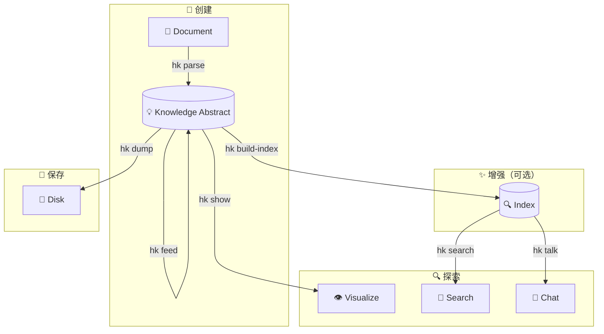

# CLI 指南

Hyper-Knowledge CLI (`hk`) 提供了强大、易用的界面，可直接从终端进行知识提取。

---

## 安装

=== "uv (推荐)"

    ```bash
    uv tool install git+https://github.com/hanxiangmin/Hyper-Knowledge.git
    ```

=== "pipx"

    ```bash
    pipx install git+https://github.com/hanxiangmin/Hyper-Knowledge.git
    ```

验证安装：

```bash
hk --version
```

---

## 快速命令参考

| 命令 | 用途 | 常用参数 |
|---------|---------|--------------|
| `hk parse` | 从文档提取知识 | `-t` 模板, `-o` 输出, `-l` 语言 |
| `hk show` | 可视化知识图谱 | — |
| `hk export obsidian` | 导出为 Obsidian 知识库 | `-o` 输出, `--name`, `-f` 强制 |
| `hk search` | 知识库语义搜索 | `-n` top-k 结果数 |
| `hk talk` | 与知识库对话 | `-i` 交互模式, `-q` 查询 |
| `hk feed` | 增量添加文档 | — |
| `hk info` | 显示知识库统计信息 | — |
| `hk build-index` | 构建/重建搜索索引 | `-f` 强制重建 |
| `hk clean` | 删除 KA 的索引（或整个 KA） | `-a` all, `-y` yes |
| `hk list` | 列出模板和方法 | `template` 或 `method` |
| `hk config` | 管理配置 | `init`, `show`, `llm`, `embedder` |

---

## 完整工作流程

提取和交互知识的典型工作流程：



1. **创建** — 从文档提取知识 (`hk parse`)
2. **增强** — 增量添加文档 (`hk feed`)、构建索引 (`hk build-index`)
3. **探索** — 可视化 (`hk show`)、搜索 (`hk search`)、对话 (`hk talk`)
4. **保存** — 持久化到磁盘 (`hk dump`)

→ [详细工作流程指南](workflow.md)

---

## 快速开始

### 1. 配置 API 密钥

=== "OpenAI"

    ```bash
    hk config init -p openai -k YOUR_OPENAI_API_KEY
    ```

=== "百炼 (阿里云)"

    ```bash
    hk config init -p bailian -k YOUR_BAILIAN_API_KEY
    ```

=== "DeepSeek"

    ```bash
    hk config llm -p deepseek -k YOUR_DEEPSEEK_API_KEY
    hk config embedder -p openai -k YOUR_OPENAI_API_KEY
    ```

=== "Anthropic (Claude)"

    Anthropic 仅提供 LLM —— 请搭配 OpenAI 兼容嵌入器：

    ```bash
    hk config llm -p anthropic -k YOUR_ANTHROPIC_API_KEY
    hk config embedder -p openai -k YOUR_OPENAI_API_KEY
    ```

=== "本地 vLLM"

    需先安装 [vLLM](https://docs.vllm.ai/) 并分别启动 LLM 和 Embedding 服务：

    ```bash
    # 启动 LLM 服务（约需 8GB 显存）
    vllm serve Qwen/Qwen3.5-9B --port 8000 --api-key dummy

    # 启动 Embedding 服务（约需 2GB 显存）
    vllm serve BAAI/bge-m3 --task embed --port 8001
    ```

    然后配置 Hyper-Knowledge：

    ```bash
    hk config llm -p vllm \
      -u http://localhost:8000/v1 \
      -k dummy \
      -m Qwen/Qwen3.5-9B

    hk config embedder -p vllm \
      -u http://localhost:8001/v1 \
      -k dummy \
      -m BAAI/bge-m3
    ```

    > 完整部署参数（量化、Docker 等）见 [Provider 系统](../concepts/provider-system.md)。

### 2. 提取知识

```bash
hk parse document.md -t general/biography_graph -o ./output/ -l zh
```

### 3. 可视化

```bash
hk show ./output/
```

---

## 详细命令

### 知识提取

- **[`hk parse`](commands/parse.md)** — 从文档提取知识
- **[`hk feed`](commands/feed.md)** — 向现有知识库添加文档

### 探索

- **[`hk show`](commands/show.md)** — 可视化知识图谱
- **[`hk search`](commands/search.md)** — 语义搜索
- **[`hk talk`](commands/talk.md)** — 与知识库对话
- **[`hk info`](commands/info.md)** — 查看知识库统计信息
- **[`hk export obsidian`](commands/export.md)** — 导出为 Obsidian 知识库

### 管理

- **[`hk build-index`](commands/build-index.md)** — 构建搜索索引
- **[`hk clean`](commands/clean.md)** — 删除 KA 的索引，或整个 KA
- **[`hk list`](commands/list.md)** — 列出可用模板/方法
- **[`hk config`](commands/config.md)** — 配置管理

---

## 配置

CLI 在 `~/.hk/config.toml` 存储配置。

→ [配置参考](configuration.md)

---

## 模板 vs 方法

Hyper-Knowledge 提供两种提取知识的方式：

### 模板（适用于大多数用户）

特定领域的开箱即用配置：

```bash
hk parse doc.md -t general/biography_graph -l zh
```

### 方法（高级）

底层提取算法：

```bash
hk parse doc.md -m light_rag
```

→ [了解何时使用每种方式](../concepts/architecture.md)

---

## 语言支持

模板支持多种语言：

```bash
# 英文
hk parse doc.md -t general/biography_graph -l en

# 中文
hk parse doc.md -t general/biography_graph -l zh
```

方法模板始终使用英文提示。

---

## 用例示例

### 研究

```bash
# 从研究论文提取
hk parse paper.md -t general/concept_graph -o ./paper_kb/ -l zh

# 提问
hk talk ./paper_kb/ -q "主要贡献是什么？"
```

### 传记分析

```bash
# 从传记提取
hk parse biography.md -t general/biography_graph -o ./bio_kb/ -l zh

# 可视化生平事件
hk show ./bio_kb/
```

### 法律文档分析

```bash
# 提取合同义务
hk parse contract.md -t legal/contract_obligation -o ./contract_kb/ -l zh

# 搜索特定条款
hk search ./contract_kb/ "终止条件"
```

---

## 技巧和最佳实践

1. **为特定领域任务使用模板** — 针对特定用例进行了优化
2. **构建索引** — 搜索和聊天功能需要索引
3. **增量摄入** — 随着时间添加文档，无需重新处理
4. **选择正确的语言** — 改善非英文文档的提取质量

---

## 获取帮助

- 查看任何命令的帮助：`hk <command> --help`
- 列出所有模板：`hk list template`
- 列出所有方法：`hk list method`
- [常见问题](../resources/faq.md)
- [故障排除](../resources/troubleshooting.md)
