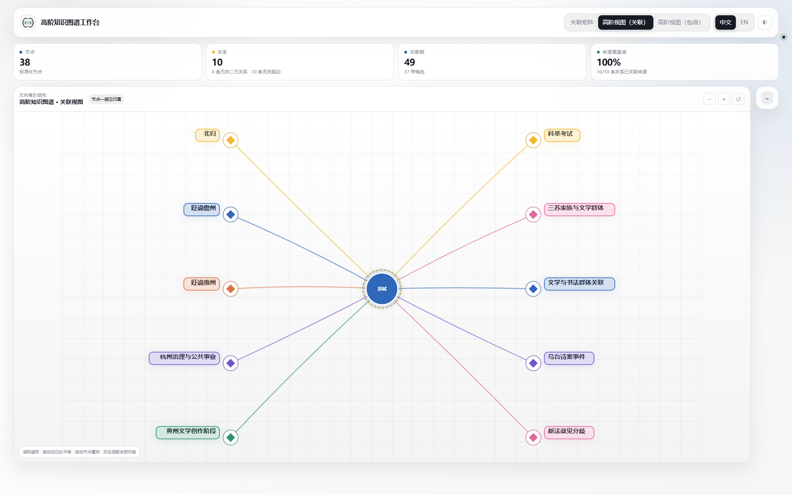
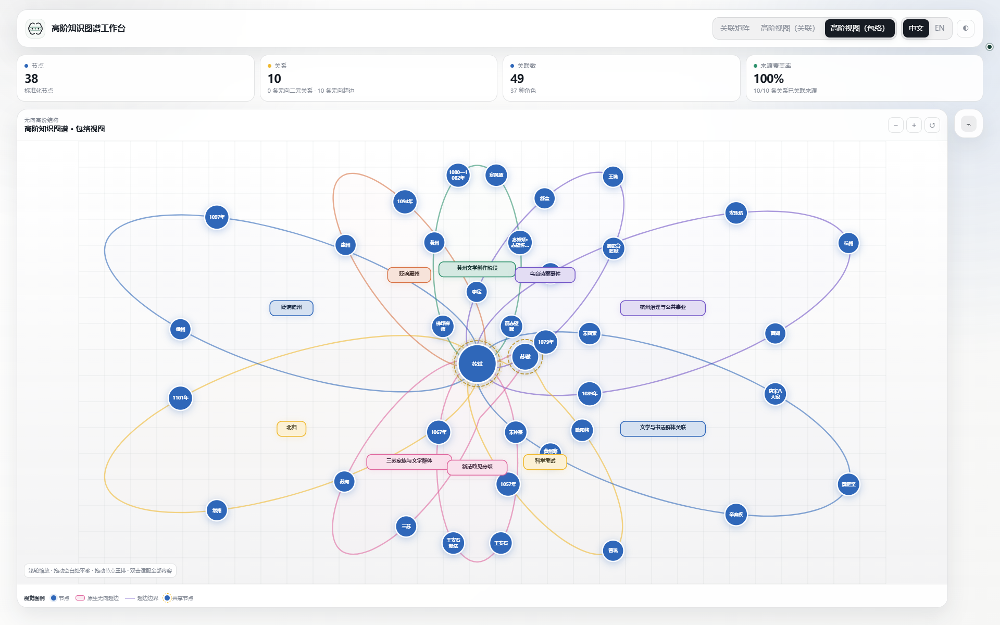
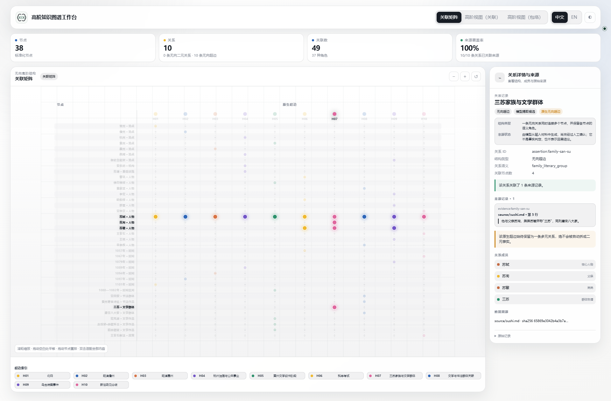
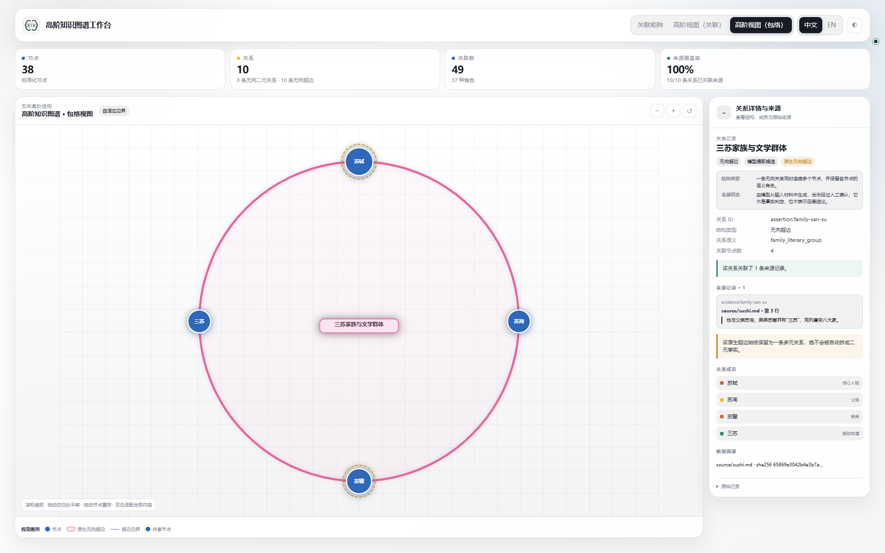
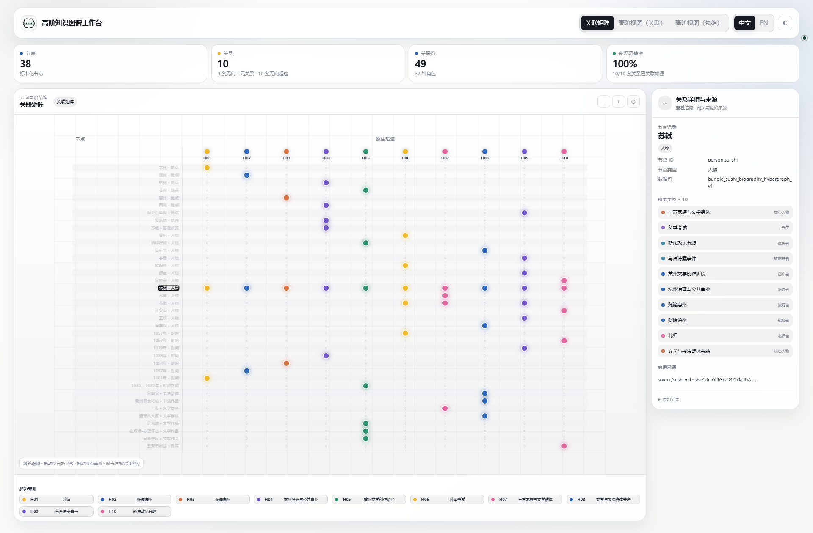
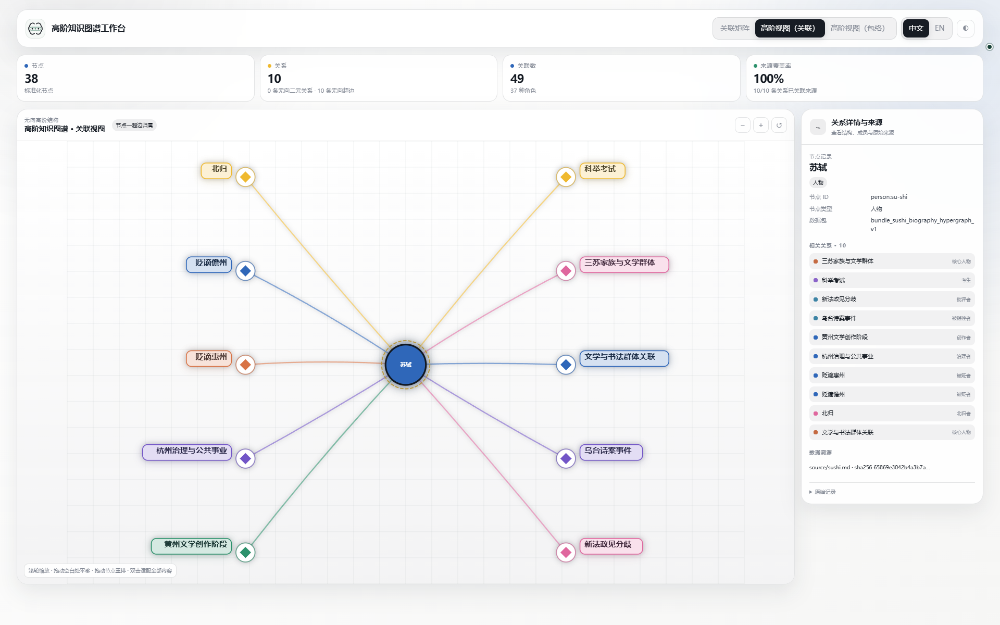
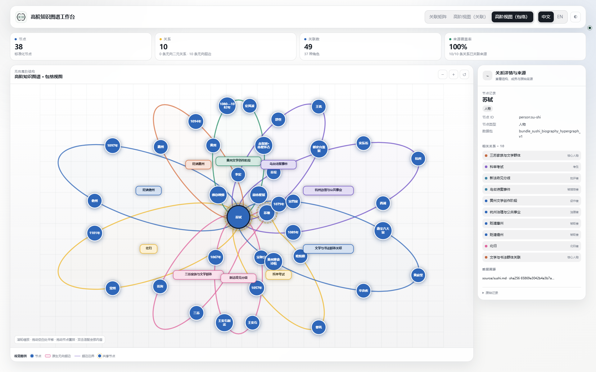

# 三种视图，三个问题

同一份数据包，可以读成一张表、一组成员关联，或一组包络。切换视图改变阅读方式，不改变实体与成员关系。

[查看原尺寸 GIF](../../assets/showcase-v2/tour-zh.gif) · [英文 GIF](../../assets/showcase-v2/tour-en.gif) · [阅读苏轼案例](sushi.md)

七个画面、共 8 秒：总览 → 一条超边 → 一个节点 → 悬停高亮。前六个画面从真实本地浏览器录屏中按正常速度各截取 1 秒；最后的悬停以半速播放 2 秒，让鼠标移动和高亮变化更容易看清。下方图集保留完整十个状态。英文版使用英文界面与讲解，原文的节点名、超边名仍保留中文。

## 先选问题，再选视图

| 想看什么 | 视图 | 选中后的变化 |
| --- | --- | --- |
| 哪个节点属于哪条超边？ | 关联矩阵 | 保留完整矩阵，高亮选中对象 |
| 这个节点属于哪些超边？这条超边包含谁？ | 关联视图 | 展示节点所属的超边，或展开超边的全部成员 |
| 哪些关系共享了上下文？ | 包络视图 | 用空间结构阅读共享关系；点击聚焦，悬停突出 |

关联图中的菱形表示关系，不是从文档中额外抽出的实体；连线旁的文字是成员角色。包络图中，共享节点带虚线外环；节点面积不代表人物的重要程度。

## 十个状态，同一份数据

下面始终使用 **三苏家族与文学群体**（`assertion:family-san-su`）和 **苏轼**（`person:su-shi`）作对照。展开分组，点击任意截图即可查看原图。

01–03 · 总览：同一份数据的三种读法

<figure markdown>

<figcaption>01 · 关联矩阵：完整成员关系表。</figcaption>
</figure>
<figure markdown>

<figcaption>02 · 关联视图：初始关系总览。</figcaption>
</figure>
<figure markdown>

<figcaption>03 · 包络视图：完整高阶结构。</figcaption>
</figure>

04–06 · 选中超边：三苏家族与文学群体

这条超边包含苏轼、苏洵、苏辙和三苏。成员角色分别区分核心人物、父亲、弟弟和群体称谓。

<figure markdown>

<figcaption>04 · 关联矩阵：在完整表中高亮这条超边。</figcaption>
</figure>
<figure markdown>

<figcaption>05 · 关联视图：展开四个成员，每条连接注明角色。</figcaption>
</figure>
<figure markdown>

<figcaption>06 · 包络视图：同样的四个成员，放在同一关系中阅读。</figcaption>
</figure>

07–09 · 选中节点：苏轼

苏轼在这个示例中属于十条超边。关联视图只汇总这些归属，不展开其他全部成员；包络视图则保留这些超边中的成员上下文。

<figure markdown>

<figcaption>07 · 关联矩阵：高亮苏轼的成员关联，不过滤全表。</figcaption>
</figure>
<figure markdown>

<figcaption>08 · 关联视图：一个节点，与它所属的十条超边。</figcaption>
</figure>
<figure markdown>

<figcaption>09 · 包络视图：在共享关系中阅读当前节点。</figcaption>
</figure>

10 · 鼠标悬停：突出一条关系

把鼠标移到三苏超边的标题上：对应包络浅色填充，成员保持清晰，其他内容淡化。移开鼠标即可恢复总览，不需要点击，也不改变数据。

<figure markdown>

<figcaption>10 · 包络悬停：可与状态 03 的未高亮总览对照。</figcaption>
</figure>

## 阅读、调整与重置

- **点击**节点或超边，查看成员、角色与来源详情。
- **悬停**超边标题，在共享结构中辨认当前关系。
- **拖动**节点，调整位置并重新拟合相关包络；知识记录保持不变。
- **重置**清除聚焦与局部布局变化，重新适配全部内容。

关系密集时，用矩阵查归属通常比继续缩小文字更容易读。工作台是独立 HTML 文件，阅读已有导出不需要模型服务或服务器。
