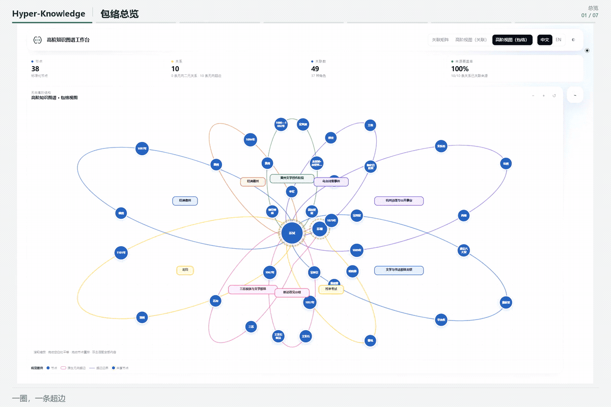
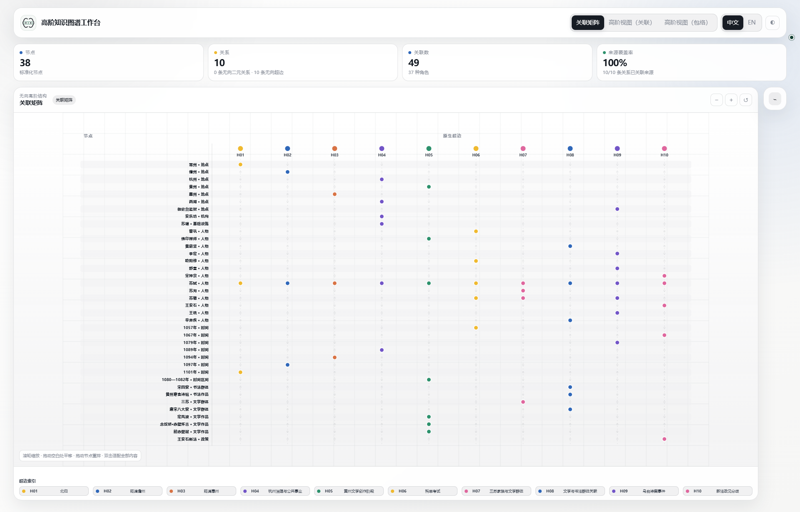
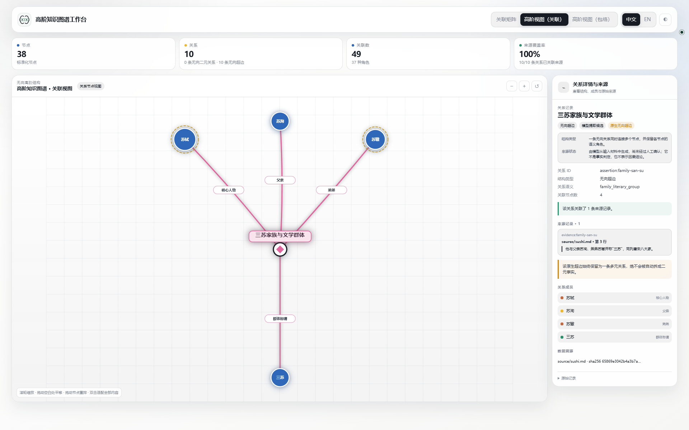
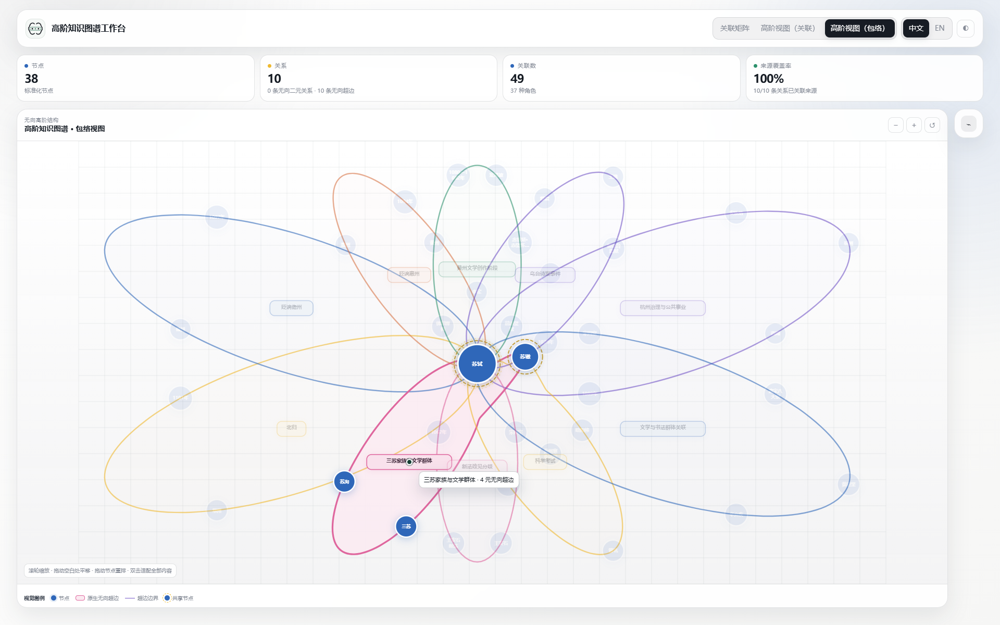

<div class="hk-hero" markdown>
<p class="hk-kicker">Hyper-Knowledge / Agent Skill</p>

# 让关系保留上下文。

<p class="hk-lead">人物、时间、地点和角色，常常共同解释一件事。Hyper-Knowledge 把这样的共同语境组织成超边，交给智能体构建，再用可追溯的数据包和离线工作台检查、阅读与分享。</p>

[安装 Skill](guide/install.md){ .md-button .md-button--primary }
[从苏轼案例开始](guide/sushi.md){ .md-button }
</div>

## 用 Codex 安装

已安装并登录 Codex CLI 后，在准备保存项目的目录中运行（Bash / PowerShell）：

```bash
codex '从 https://github.com/hanxiangmin/Hyper-Knowledge 安装完整的 hyper-knowledge：按仓库的手动安装步骤在持久 Python 环境中安装运行时和用户级 Codex Skill，最后运行 hk skill doctor --scope user --deep --json 验证。'
```

按提示确认联网和安装操作。[手动安装](guide/install.md)

<figure class="hk-media" markdown>

[](../assets/showcase-v2/tour-zh.gif)

<figcaption>8 秒循环 GIF：总览 → 超边 → 节点 → 悬停。前六个画面各 1 秒，最后的悬停半速播放 2 秒；点击可查看原尺寸 GIF。</figcaption>
</figure>

## 从一个具体问题出发

“苏轼在何时、何地经历了什么？”不适合塞进一个很长的节点名。

| 实体节点 | 事件超边 | 成员角色 |
| --- | --- | --- |
| 苏轼、1101 年、常州 | 北归 | 北归者、时间、到达地 |

人物和地点可以被下一件事复用；年份不会与另一段经历混在一起。来源则跟在这条事件关系后面，供阅读者继续核对。[查看建模方法](guide/modeling.md)

## 围绕一份可交付的图谱工作

<div class="hk-three" markdown>
<section markdown>

### 建模

用 Skill 说明任务和材料。先确定节点、事件与角色，再选择模板执行；不是把整句话缩成节点名。

[处理第一份文档](guide/document.md)
</section>
<section markdown>

### 核验

节点、关系、成员和来源分别保存。校验引用与文件身份，区分原文支持、模型组织和待核验内容。

[读懂数据包](guide/artifacts.md)
</section>
<section markdown>

### 探索

从整体结构进入一个节点，再展开一条超边。密集关系交给矩阵，解释成员角色时切换关联视图。

[选择合适的视图](guide/workbench.md)
</section>
</div>

## 交给智能体的一句话

```text
用 hyper-knowledge 处理这份文档。
人物、地点、时间分别建节点；每个事件保留为一条超边，并注明成员角色。
输出可校验的 bundle 和离线工作台，列出缺少来源支持的关系。
```

Skill 负责把需求转成可检查的步骤；`hk` 负责执行。没有模型配置也可以先运行离线演示，确认安装和渲染是否正常。[安装与检查](guide/install.md)

## 先看清，再深入

<div class="hk-gallery" markdown>
<figure markdown>

[](../assets/showcase-v2/overview-matrix-zh.png)

<figcaption>用矩阵查归属，避开交叉连线。</figcaption>
</figure>
<figure markdown>

[](../assets/showcase-v2/edge-incidence-zh.png)

<figcaption>展开一条超边，看成员与角色。</figcaption>
</figure>
<figure markdown>

[](../assets/showcase-v2/hover-enclosure-zh.png)

<figcaption>当前关系着色，其余内容淡化。</figcaption>
</figure>
</div>
