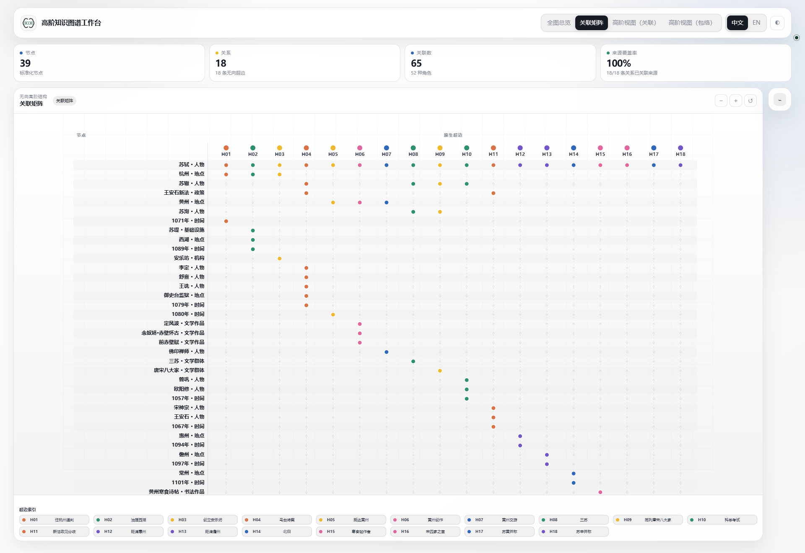
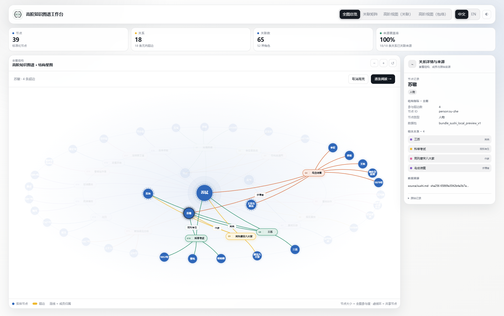

<div class="hk-hero" markdown>
<p class="hk-kicker">Hyper-Knowledge / Python · CLI · Agent Skill</p>

# 让关系保留上下文。

<p class="hk-lead">人物、时间、地点和角色，常常共同解释一件事。Hyper-Knowledge 把这样的共同语境组织成超边，交给智能体构建，再用可追溯的数据包和离线工作台检查、阅读与分享。</p>

[开始使用](guide/install.md){ .md-button .md-button--primary }
[从苏轼案例开始](guide/sushi.md){ .md-button }
</div>

## 两种安装方式

有 Python 或 Conda 环境，直接使用；没有环境，再按教程准备。命令行安装与聊天安装任选其一。

[命令行安装说明](guide/install.md#command-line){ .md-button .md-button--primary }
[聊天安装说明](guide/install.md#chat-install){ .md-button }

<details markdown>
<summary>命令行安装：已有环境 / Anaconda / Miniconda</summary>

已有合适的 **Python 3.11+ 环境**，激活后直接安装；Anaconda / Miniconda 用户按下面的 Conda 步骤操作。没有可用环境时，再看[Python / venv 准备步骤](guide/install.md#command-line)，不用人人从头安装 Python。

<details markdown>
<summary>Anaconda / Miniconda：展开新建与复用环境的步骤</summary>

Windows 打开 **Anaconda Prompt / Miniconda Prompt**；macOS / Linux 用能运行 `conda` 的终端。

先用 `conda env list` 查看环境。要新建时，确认 `hyper-knowledge` 这个名字尚未使用，再逐行执行，前一步成功后再执行下一步：

<!-- hk-install-conda:start -->
```bash
conda create -n hyper-knowledge python=3.12 pip git
conda activate hyper-knowledge
```
<!-- hk-install-conda:end -->

如果已经有合适环境，不创建新环境，直接 `conda activate research`，将 `research` 换成你自己的环境名。检查 Python、pip 和 Git：

```bash
python --version
python -c "import sys; print(sys.executable)"
python -m pip --version
git --version
```

Python 应为 3.11+，解释器和 pip 都应属于目标环境。需要补 pip 或 Git 时，在确认可修改该环境后先 `conda install pip git`，再安装本项目。不要往 `base` 或需要保持不变的实验环境里安装，不需要在 Conda 内另建 `.venv`。

每次打开新终端，重新 `conda activate hyper-knowledge`（或自己的环境名），而不是重新安装。[Conda 详细说明、脚本调用和 Notebook](guide/install.md#reopen-shell)

</details>

在**已经选好的环境**中逐行运行；前一步成功后再执行下一步：

<!-- hk-install-runtime:start -->
```bash
python -m pip install "git+https://github.com/hanxiangmin/Hyper-Knowledge.git"
python -m hyperknowledge --help
```
<!-- hk-install-runtime:end -->

帮助页面出现后，需要 Skill 的用户再选择自己的客户端：

**Codex：**

```bash
python -m hyperknowledge skill install --platform codex --scope user
```

**Kimi Code：**

```bash
python -m hyperknowledge skill install --platform kimi --scope user
```

两个客户端都使用时可以分别安装，共用同一个运行程序。只使用 Python / Notebook 或命令行，不必安装 Skill。`hk` 不是系统内置命令；这里用 `python -m hyperknowledge` 调用选中环境的运行程序，不要求事先识别 `hk`。

[已有安装与本地修改](guide/install.md#existing-installation) · [找不到命令等问题](guide/install.md#installation-check)

</details>

### 在聊天中安装

选择你正在使用的客户端，直接复制对应的完整文案到聊天框：

**Codex**

```text
请按 https://github.com/hanxiangmin/Hyper-Knowledge 的安装说明，为 Codex 安装用户级 hyper-knowledge Skill。可使用已有 Python/Conda 环境，覆盖本地修改前先询问。
```

**Kimi Code**

```text
请按 https://github.com/hanxiangmin/Hyper-Knowledge 的安装说明，为 Kimi Code 安装用户级 hyper-knowledge Skill。可使用已有 Python/Conda 环境，覆盖本地修改前先询问。
```

不需要先手动执行命令行安装。安装细节按仓库说明处理；需要登录或授权时由你确认。完成后开启新会话使用。普通网页聊天如果没有本地工具权限，不能替电脑安装程序。

## 安装后，一套核心、三种用法

安装完成后，在选好的 Python / Conda 环境中使用下面任意入口。[新终端怎样选择环境](guide/install.md#reopen-shell)

<div class="hk-three" markdown>
<section markdown>

### Python / Notebook

`extract_file()` 解析文本；`import_graph()` 导入结构化结果，不需要模型密钥。

[Python 指南](guide/python.md) · [API 参考](guide/api.md)
</section>
<section markdown>

### 命令行

`hk parse` → `hk bundle export` → `hk visualize`。
已有结构化结果直接使用 `hk bundle import`。

[完整命令与样例](guide/commands.md)
</section>
<section markdown>

### Agent Skill

Codex、Kimi Code 读取同一份标准 Skill，调用本地 Python。
默认使用当前 Agent 的模型，不额外配置一份密钥。

[安装与唤起](guide/agents.md) · [兼容性记录](guide/compatibility.md)
</section>
</div>

<figure class="hk-media" markdown>

[](../assets/showcase-v3/tour-zh.gif)

<figcaption>8 秒循环 GIF：结构总览 → 关联矩阵 → 点击超边 → 点击节点 → 包络悬停。画面剪自真实本地浏览器录屏；点击可查看原尺寸 GIF。</figcaption>
</figure>

## 从一个具体问题出发

“苏轼在何时、何地经历了什么？”不适合塞进一个很长的节点名。

| 实体节点 | 事件超边 | 成员角色 |
| --- | --- | --- |
| 苏轼、1101 年、常州 | 北归 | 北归者、时间、到达地 |

人物和地点可以被下一件事复用；年份不会与另一段经历混在一起。来源则跟在这条事件关系后面，供阅读者继续核对。[查看建模方法](guide/modeling.md)

## 围绕一份可交付的图谱工作

<div class="hk-three" markdown>
<section markdown>

### 建模

用 Skill 说明任务和材料。先确定节点、事件与角色，再选择模板执行；不是把整句话缩成节点名。

[处理第一份文档](guide/document.md)
</section>
<section markdown>

### 核验

节点、关系、成员和来源分别保存。校验引用与文件身份，区分原文支持、模型组织和待核验内容。

[读懂数据包](guide/artifacts.md)
</section>
<section markdown>

### 探索

从整体结构进入一个节点，再展开一条超边。密集关系交给矩阵，解释成员角色时切换关联视图。

[选择合适的视图](guide/workbench.md)
</section>
</div>

## 交给智能体的一句话

```text
用 hyper-knowledge 处理这份文档。
人物、地点、时间分别建节点；每个事件保留为一条超边，并注明成员角色。
输出可校验的 bundle 和离线工作台，列出缺少来源支持的关系。
```

当前 Agent 读取原文，本地 Python 导入并渲染结果；这条流程不额外配置一份模型密钥。[了解两种流程](guide/agents.md)

## 先看清，再深入

点击图片全屏查看，再点图片、空白处或按 Esc 返回原位置。

<div class="hk-gallery" markdown>
<figure markdown>

[](../assets/showcase-v3/overview-enclosure-zh.png)

<figcaption>用整体结构先看共享节点与超边分布。</figcaption>
</figure>
<figure markdown>

[](../assets/showcase-v3/overview-matrix-zh.png)

<figcaption>用矩阵查归属，避开交叉连线。</figcaption>
</figure>
<figure markdown>

[](../assets/showcase-v3/edge-incidence-zh.png)

<figcaption>展开一条超边，看成员与角色。</figcaption>
</figure>
<figure markdown>

[](../assets/showcase-v3/node-su-zhe-overview-zh.png)

<figcaption>点击苏辙，查看其参与的四条超边，其余关系淡化。</figcaption>
</figure>
</div>
